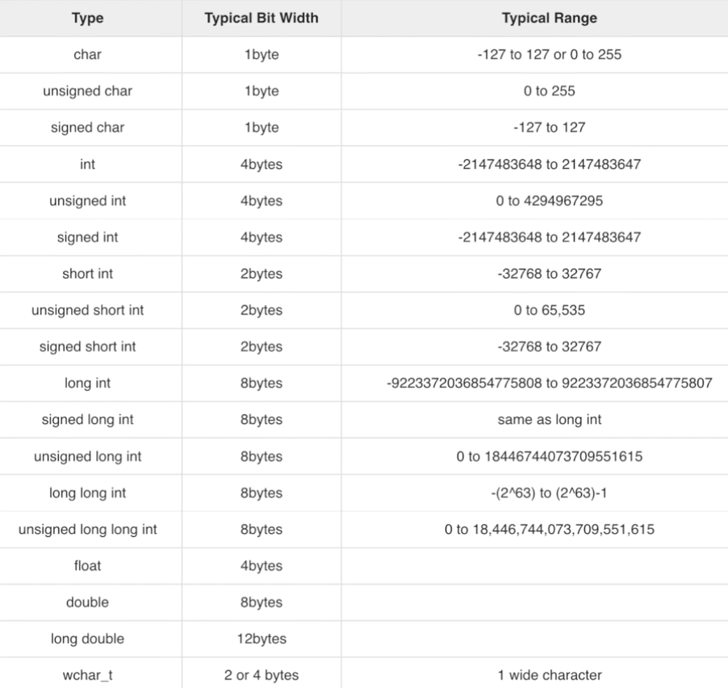

## 12th december 2025: c++ basics

today i'll be going through some of the c++ basics that he shows in c++ in one shot video and these are the points i'll be covering specifically:
1. c++ skeleton code
2. input and output in c++ some escape character and in built function
3. data types
4. if else
5. nested if else

---

### 1. c++ skeleton code

in the very beginning we saw the skeleton of c++ code that we'll be using throughout and it looks like this:
```
#include<iostream>

int main () {
    // whatever program you write here
    return 0;
}
```

then we learnt how to print an output to the terminal
```
#include<iostream>

int main () {
    std::cout << "dsa haha" << std::endl << "hey how are you?";
    return 0;
}
```
here, you might have noticed that we have to use the std namespace everywhere we want to use any function or so, right? that's why we overcame this problem with adding this line in our headers
```
#include<iostream>
using namespace std;

int main () {
    cout << "dsa haha" << endl << "hey how are you?";
    return 0;
}
```
and it'll work exactly as before. but there's another catch, you know what currently we have imported only one library that is `#include<iostream>`, this is specifically for input, output and some other things but what is you want to do something with strings, something with math functions, or something else, will you keep on importing libraries one after other? no, we won't we'll simply add this line in our header and it includes all the libraries of c++
```
#include<bits/stdc++.h>
using namespace std;

int main () {
    cout << "dsa haha" << endl << "hey how are you?";
    return 0;
}
```
so `#include<bits/stdc++.h>` this will include all libraries now.

but whilst doing this on my mac, this directory (`bits/stdc++.h`) wasn't there, so i searched on google and solved the problem through this stackoverflow solution: https://stackoverflow.com/a/40935471

so yeah this is our final skeleton that we'll be using throughout:
```
#include<bits/stdc++.h>
using namespace std;

int main () {
    // whatever your program is
    return 0;
}
```

---

for all the next points, i guess writing code was self explanatory so i'm not writing any notes for the same here, you could refer my code files for respective topic for this day

and yeah here's the data types ranges:



wrapping up 12th december 2025 and see you tomorrow!