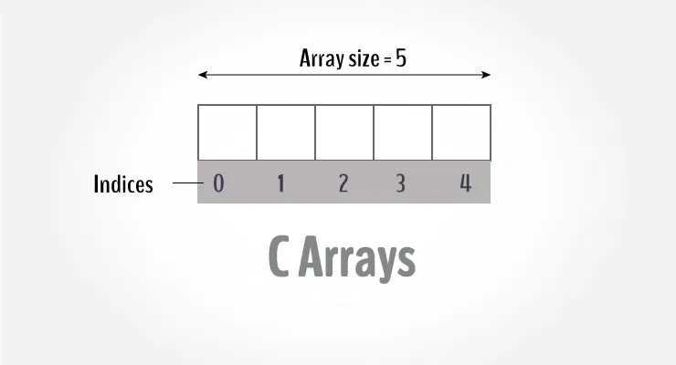

## 13th december 2025: c++ basics

today i'll be continuing through some of the c++ basics that he shows in c++ in one shot video and these are the points i'll be covering specifically:
1. switch statement
2. arrays and strings
3. for and while loops
4. functions

---

### 1. switch statement
we learn about switch statements by a simlpe problem, like whenever a user enters a number, we have to print name of the day accordingly.

so there were main things we learnt like if we not have break after each case, then we would get output from the case that's true, till the end it would print everything from other cases, that's why we implemented break and finally explored the default case.

---

### 2. arrays and strings

#### arrays:
in arrays i learn about 1d array and 2d array. in 1d array we store values of same data type, like it's a collection of elements of same data types. for example, if you have integers, you define an integer array like `int arr[5]`. so this will store 5 elements of integer data types. and if you give one element like 8.3, so it'll just store 8. also, arrays are stored somewhere in memory, but wherever the 0th index's address is, the index's addresses will be consecutively after it.

refer the image below to see how arrays are stored.

img credits: programiz

moving on to 2d array, we define it as `int arr[3][5]`, so here 3 means, number of rows, and, 5 means, number of columns. you'll understand it more clearly, just see this image.

img credits: wscubetech

#### strings:
string is also one of the data type. it's basically a collection of characters, we could modify and fetch elements from a string based on their indices like we were doing with arrays. you could refer my file for this specifically to know more. i also learnt about `.size()` function to get the length of the string, that is the number of characters.

---

### 3. for and while loops

where the hell do these loops come into picture. let's say you want to print your name a hundred or a thousand times, or you want to check or print something multiple time, would you type `cout` those many times? nah, man. it would be so tedious, that's where this thing called loops came into picture, let me describe them in brief below.

#### for loop
so you have three main things inside while declaring a for loop, the initialisation variable, where to start from, the end condition, and lastly whatever you want to do, increment, decrement, multiply or whatever.

you could use if else statements inside for loop, you could have nested for loops and much more. i'll share more about nested for loops once we reach printing patterns and all.

#### while loop
this is similar to for loop, we have intialisation variable, then the condition, and in while block at the end, we do whatever operation like increment, decrement and stuff.

#### while loop nightmare
while writing my while loop, i forgot to add the increment statement at last, and it started running infinitely, and man, our output.txt was 1.24 gb and i restarted my code editor and realised the mistake. so yeah it happens, just move ahead.

#### do while loop

now let's say we have set the value as 2 for initialisation variable, and the condition in while loop is, run only if it's less than or equal to 1, so with our normal while loop, it wouldn't return anything, but there are some scenarios where we need to run while loop for a *minimum of one time*, and here's where do while loop comes in picture. it'll exectue the while loop once no matter the condition.

---

### 4. functions
so why do we need functions? let's say you want to do some specific task and you want to repeat that task at several places, so rewriting same logic everywhere doesn't make sense and hence we define a function and reuse it wherever we want. for example, in a calculator an add function would be one of them that we define and keep using it across our code or anywhere, and no need to write manually for each numbers.

some points to remember about functions:
- functions are set of code which performs something for you
- functions are used to modularise code
- functions are used to increase code readability
- functions are used to use same code multiple times

there are different types of function like void, which meand it doesn't return anything. then int, and many others.

then we also learnt about pass by value and pass by reference.

pass by value means in simple terms, it won't change the original value, will make a copy of original value and do operations on it.

pass by reference means, it changes the original value.

arrays are always pass by reference.

---

wrapping up 13th december 2025 and see you tomorrow!