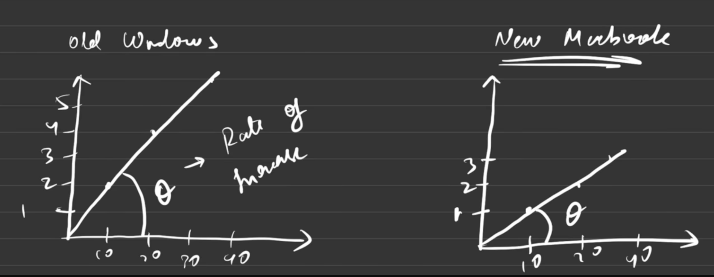
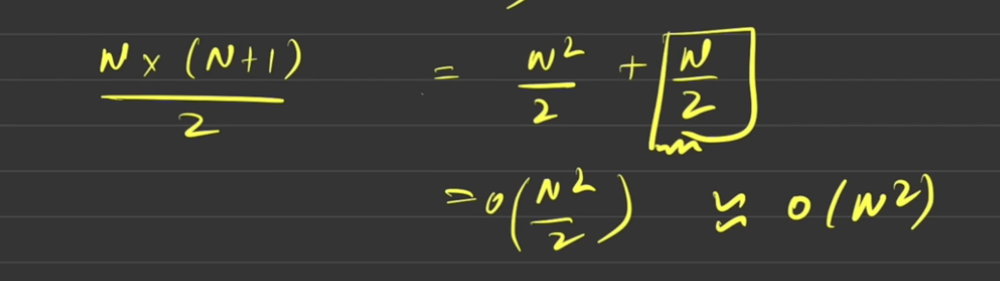

## 14th december 2025: time complexity

---

today i learnt about time complexity.

#### so what is time complexity?

first of all, why do we need time complexity, so let's imagine a scenario, you went to an interview and wrote some program, now, how will the interviewer judge your code, they will do it using something called time complexity.

so does time complexity mean, the amount of time the program takes to run on your machine, nah. because see, someone would run on an old windows machine, or someone would run on macbook with latest configurations, so the time might be 2s for windows user, and assume 1s for macbook, so this is not fair, right?

now you might think, what is time complexity then? so here's how we define it: "the rate at which the time taken increases with respect to the input size." let's understand with this diagram.

*image credits: time and space complexity - strivers a2z dsa course video*

so here for the guy with old windows machine, for him, when there are 10 inputs, or input size is 10, it needs 2s to execute, and so on. similarly for macbook guy, for size 10 input, it needs 1s and so on. so the theta (θ) angle that you see shows the rate of increase. but remeber we don't represent time complexity in seconds or minutes.

#### Big O
now you might think then how do we represent or show it. so represent it using Big O notation. it's like O(), here inside the bracket is where we'll write time taken.

now while deriving time complexity, you should remember these 3 things:
1. always calculate the time complexity for worst case scenario
2. ignore the constants
3. ignore the lower/smaller values

let's understand it from an example:
```
for (i = 1; i <= 5; i++) {
    cout << "dsa? haha!";
}
```
so here calculate the steps taken for this program to complete, so how many times will this program run 5, right? and what are the operations it's doing, first, checking if i <= 5, second, incrementing the value of i, third, printing the statement, right? so may i say like it runs `5 * 3` times, yes right. so it means there are in total 15 steps, and this is what will be time complexity O(15) or O(5 * 3). but we don't show time complexity by using numbers. so let me make a little change in our program, so you'll understand it better. here's the updated code.
```
n = 5
for (i = 1; i <= n; i++) {
    cout << "dsa? haha!";
}
```
so now may i say, that the time complexity O(n * 3 + 1)? yes. and what it says is, code will run n times and on every iteration it does 3 things, and at last the +1 that we did is the declaring variable operation/step. 

now previously i told to remember 3 things, and the first one was to calculate the time complexity for the worst scenario. so let's understand how do we do it, how do we know what's the time complexity for best case scenario, what's for average and what's for the worst scenario through another example.
```
if (marks < 25)     cout << "grade d"
else if(marks < 45) cout << "grade c"
else if(marks < 65) cout << "grade b"
else                cout << "grade a"
```
so now let's say you give 10 as an input. so it'll go into first if block execute and done, it won't go to other blocks, so here it just did 2 operations we can say, check the condition and print. so now the time complexity is O(2).

now let's say you give input as 70. what it'll do check the first if (70 < 25), no, so skip, go on to next (70 < 45), no, so skip, go on to next (70 < 65), no, so skip, and finally it'll execute the else block and print grade a, so may i say, it roughly did 4 operations, and it's time complexity is O(4).

now tell me, what will we choose as our time complexity, we'll definitely choose the worst one that's O(4) because we learnt earlier that always calculate for the worst scenario. 

and now what's the best scenario, O(2), right? and the average is just the `(best + worst / 2)`. so yeah, this is how you calculate the best, average and worst time complexities.

#### constants and lower values
now let's see what does our second point meant which was "remove constants." looking at our previous example, we got `O(n * 3 + 1)` as our time complexity. so, here if you remove 1 which is a constant, it won't have a significant impact, right? so we just remove it and now our time complexity looks like this: `O(n * 3)`. 

and now let's implement what our third point says, and it said to remove lower values. so here may i remove 3, because this also won't have much impact on our time complexity and hence out final time complexity would be `O(n)`.

#### practice time
now let's practice more by calculating time complexity for some programs.

Q1.
```
for (i = 0; i < n; i++) {
    for (j = 0; j < n; j++) {
        // single line of code block/single operation
    }
}
```
now we know we calculate time complexity using Big O notation. so here first loop will run n times, and the next loops will also run times, right? it'll go like this:
- when i = 0, j = [0, 1, 2, 3, 4, ....... n]
- when i = 1, j = [0, 1, 2, 3, 4, ....... n]
- when i = 2, j = [0, 1, 2, 3, 4, ....... n]
- when i = n - 1, j = [0, 1, 2, 3, 4, ....... n]

so we can say that both loops run n times, so i can write it like `n * n` and the time complexity would be `O(n²)`. also, notice i ignored other constants like i++ and all.

Q2. 
```
for (i = 0; i < n; i++) {
    for (j = 0; j < i; j++) {
        // single line of code block/single operation
    }
}
```
so now if i dig a bit, i can see that, this is how it would look:
- when i = 0, j = [0]
- when i = 1, j = [0, 1]
- when i = 2, j = [0, 1, 2]
- when i = 3, j = [0, 1, 2, 3]
- when i = n, j = [0, 1, 2, 3, ........, n - 1]

so now i can say the number of iterations look like this, for first time it's 1, then 2, then 3, like 
[1 + 2 + 3 + 4 + 5 + 6, ............. n]

and we know the formula for sum of first n natural numbers which is `N * (N+1) / 2` that is equal to `O(N² / 2 + N / 2)` so this is the actual time complexity:<br />
<br />
*image credits: time and space complexity - strivers a2z dsa course video*

since Big-O ignores lower-order terms or say smaller values, we drop `O(N/2) ` from `O(N²/2 + N/2)`, which gives `O(N²/2)`. further, Big-O ignores constant things, so `O(N²/2)` simplifies to O(N²).<br />
<br />
*image credits: time and space complexity - strivers a2z dsa course video*

---

wrapping up 14th december 2025 and see you tomorrow!