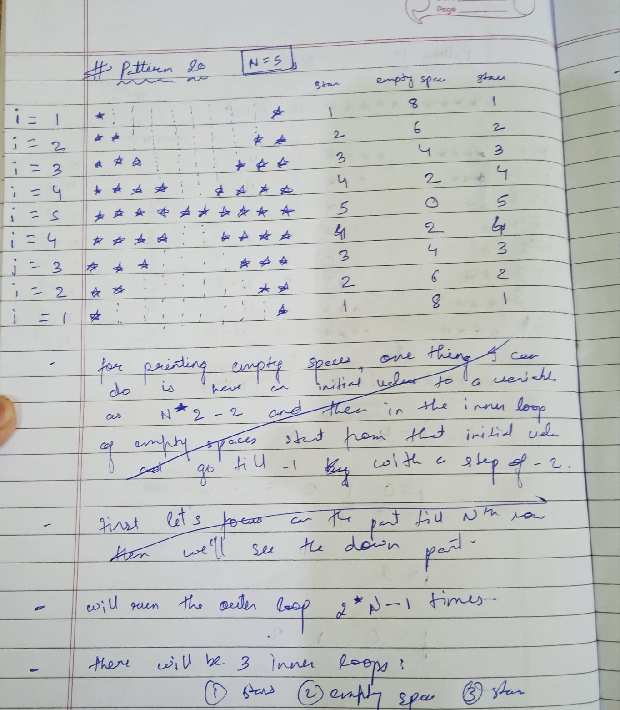
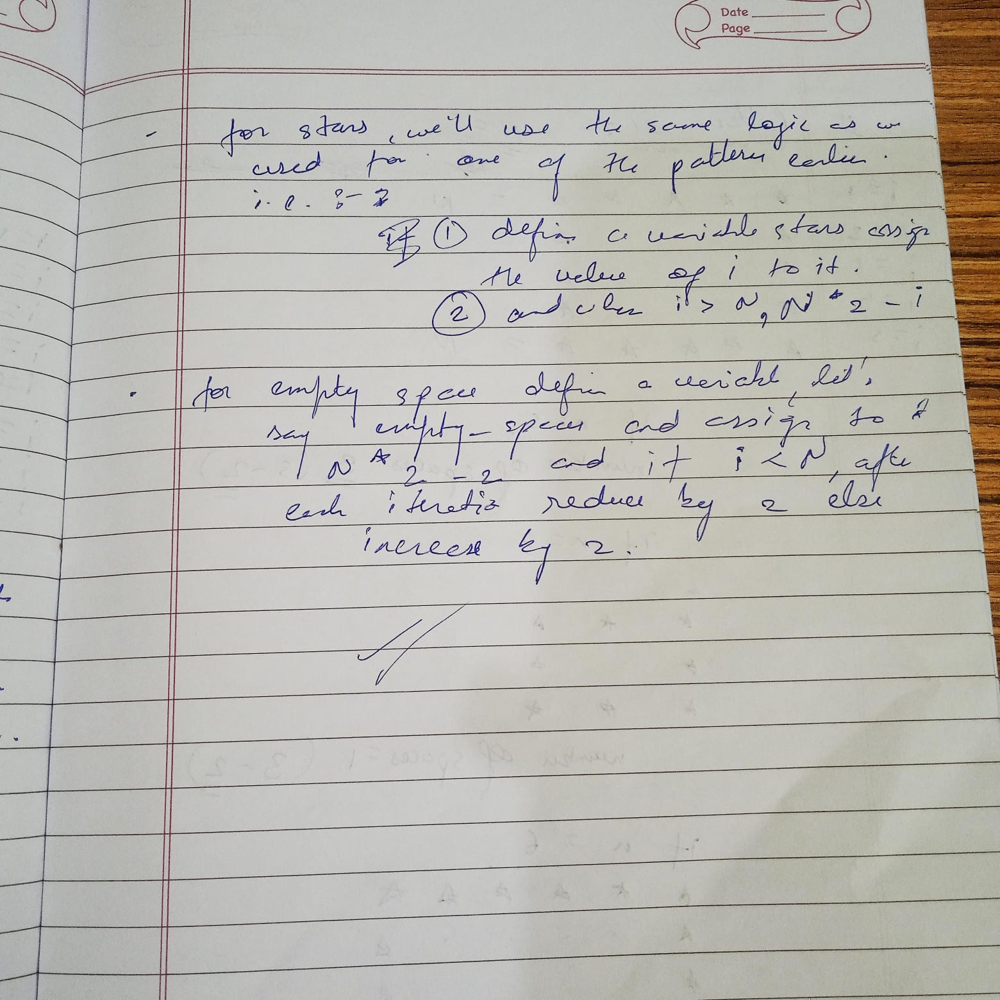
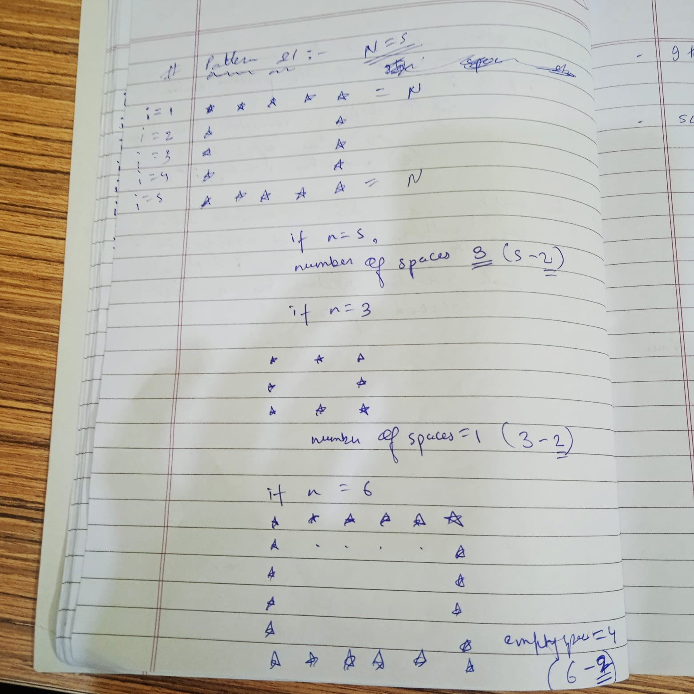
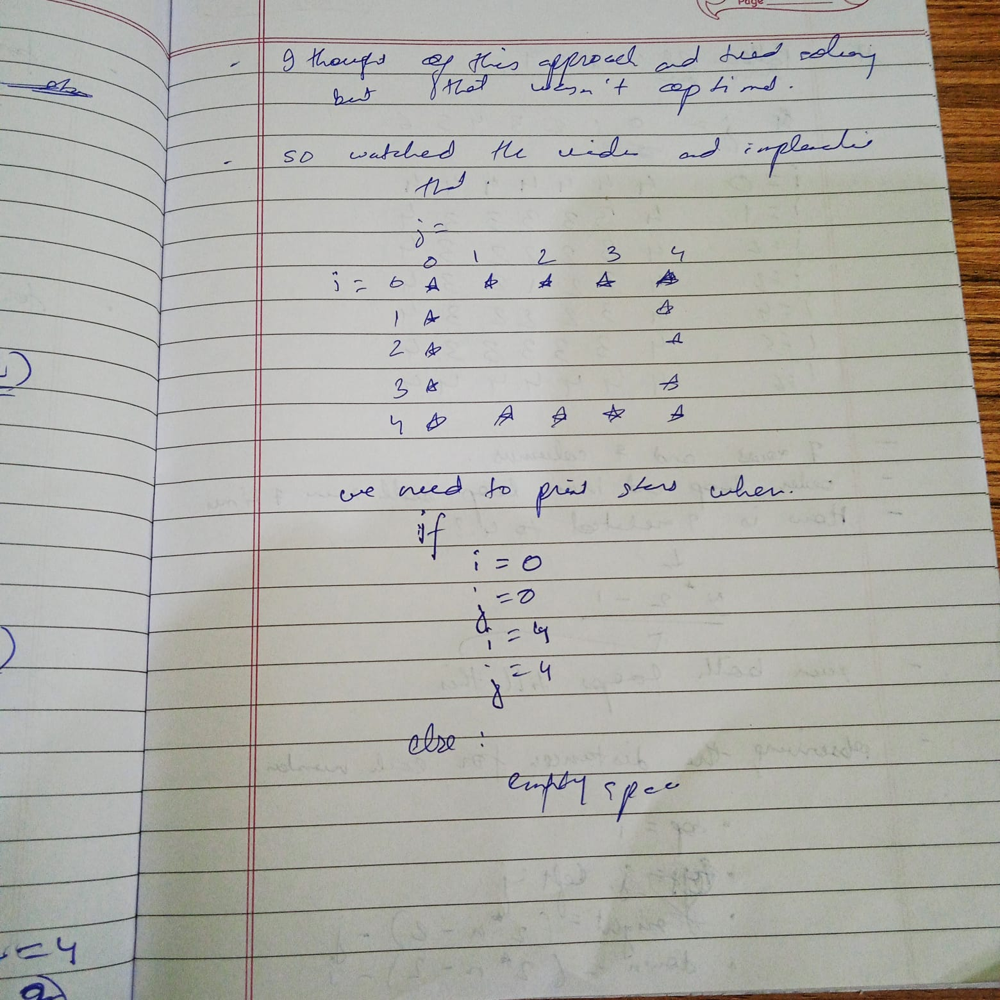
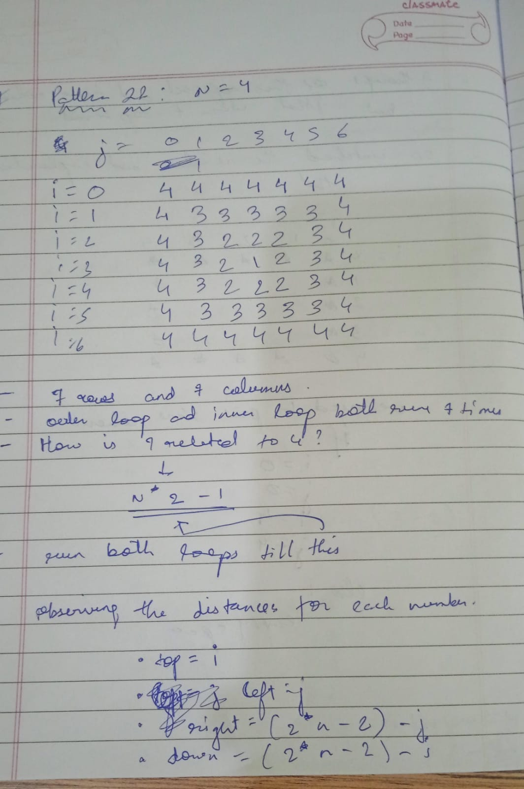

### 15th april 2026

---

these few days, i was a bit inconsistent, but finally managed to complete all the 22 patterns that were there in the striver's course specicially in the logic building module, still there are few patterns that are a bit confusing to me, so in the coming 2-3 days, my goal is to solve more patterns and strengthen my logic building and loops on side and start the basic math module.

---

---

wrapping up 15th april 2026 and see you tomorrow!